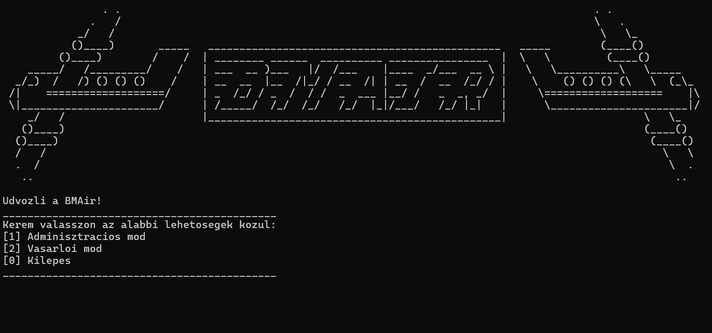
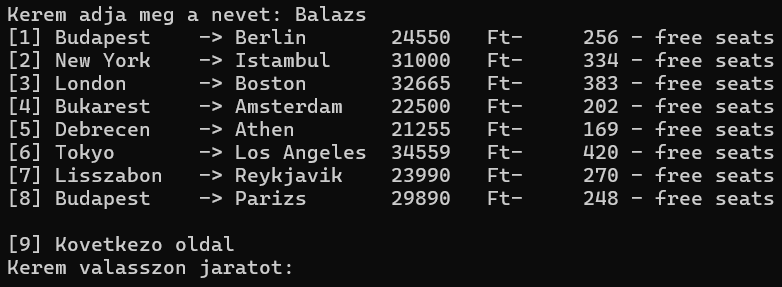

# Flight Booking Management System

A console-based application written in C for managing flight ticket purchases, seat reservations, meal orders, and administrative tasks (flight management). This project was developed as part of my university studies to demonstrate the implementation of complex data structures and file handling.

<p align="center">
  <kbd>
    
  </kbd>
  <br>
  <em>Figure 1: The main menu of the Flight Booking System</em>
</p>

## Features

### Customer Mode
* **Ticket Purchase:** Book a new flight ticket by providing passenger name and flight details.
* **Seat Selection:** Interactive seat mapping (selection by specifying row and column).
* **Meal Orders:** Multiple menu options available with quantity selection.
* **Automatic Updates:** Previous reservations and selections are automatically updated if re-booked.

<p align="center">
  <kbd>
    
  </kbd>
  <br>
  <em>Figure 2: The ticket purchase interface</em>
</p>

### Administrative Mode
* **Add New Flights:** Configure destination, price, and seat layout.
* **Inventory:** List required meals and demands for existing flights.

## Technical Details

The program is organized into **12 modules** for better maintainability and modularity.
* **Data Structures:** Uses dynamic linked lists (`Jaratok` and `Foglalasok`) in a sentinel-free implementation.
* **File Handling:** Automatically loads flight and reservation data from `Jaratok.txt` and `Foglalasok.txt` at startup and saves changes upon exit.
* **Memory Management:** Dynamic memory allocation with a dedicated cleanup process at program termination.

### Key Modules:
- `main.c`: Entry point and menu-driven main loop.
- `DataStructures.h`: Definitions of core structures (Flight, Reservation).
- `SeatHandler.c` & `FoodHandler.c`: Business logic for seat and meal management.
- `FileHandler.c`: Implementation of persistent data storage.

## Compilation and Execution

The **GCC** compiler is recommended for this project. Since it consists of multiple modules, use the following command:

```bash
gcc src/*.c -o flight_manager
./flight_manager
```
### IDE Support
While the command-line approach is recommended, the project was originally developed using **Code::Blocks 20.03**. You can also run the project by opening the `.cbp` file in Code::Blocks and using the *Build and Run* feature.

## Documentation

The detailed documentation of the application — including specifications, programmer's manual, and user guide — is available in Hungarian via the links below:

* [Specification](./docs/specifikacio.pdf) - Detailed program requirements
* [User Manual](./docs/felhasznaloi_dokumentacio.pdf) - Guide on how to use the application and its features
* [Programmers's Documentation](./docs/programozoi_dokumentacio.pdf) - Deep dive into data structures, algorithms and module descriptions.